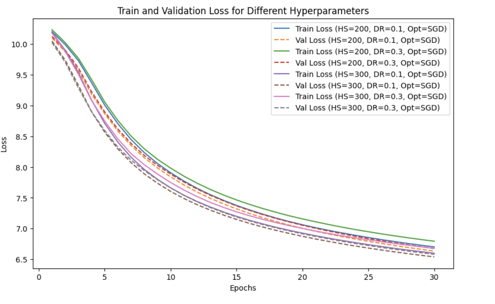
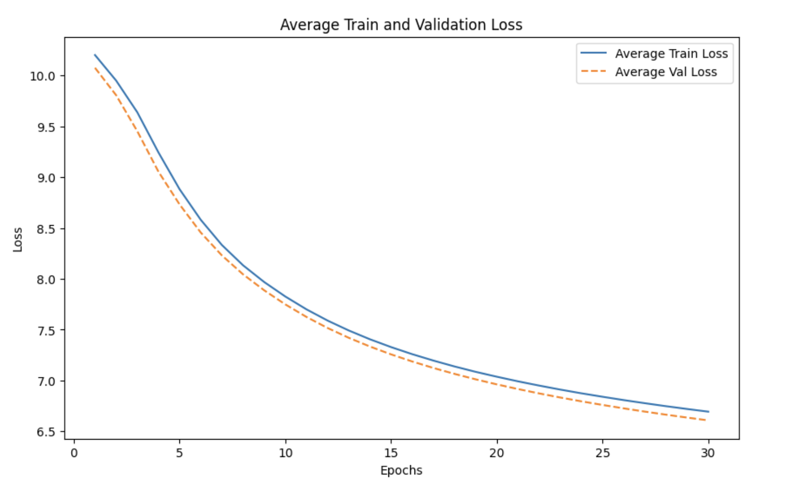
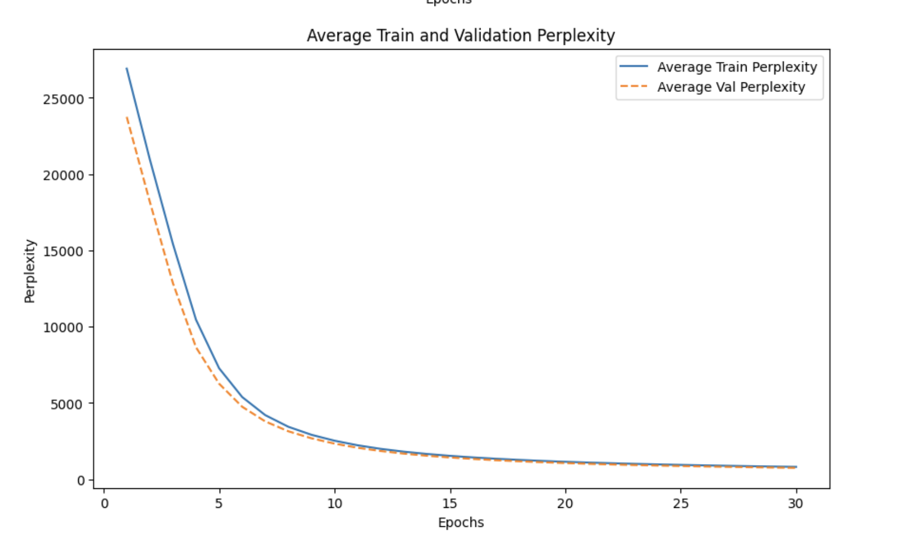
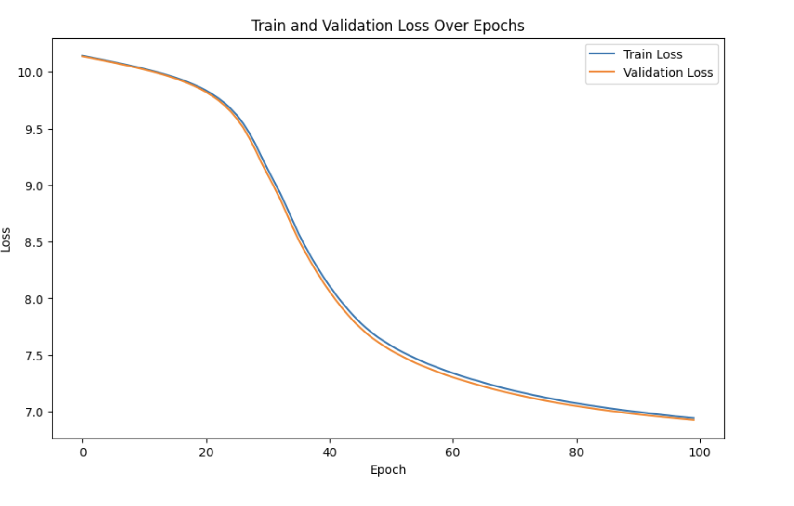
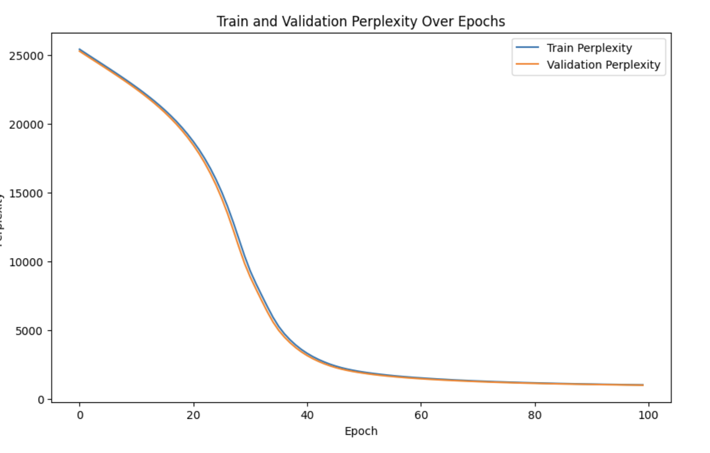
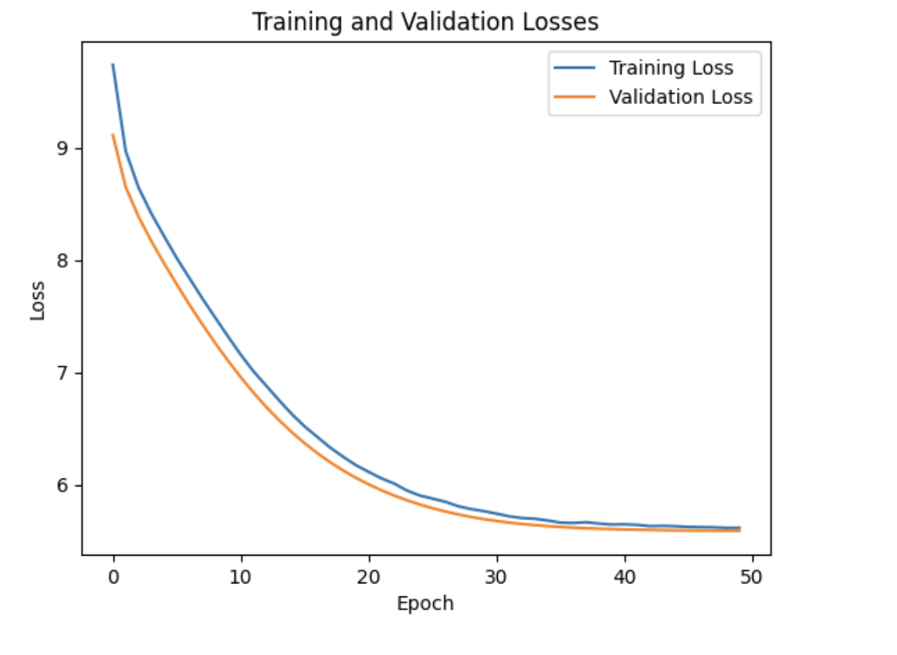
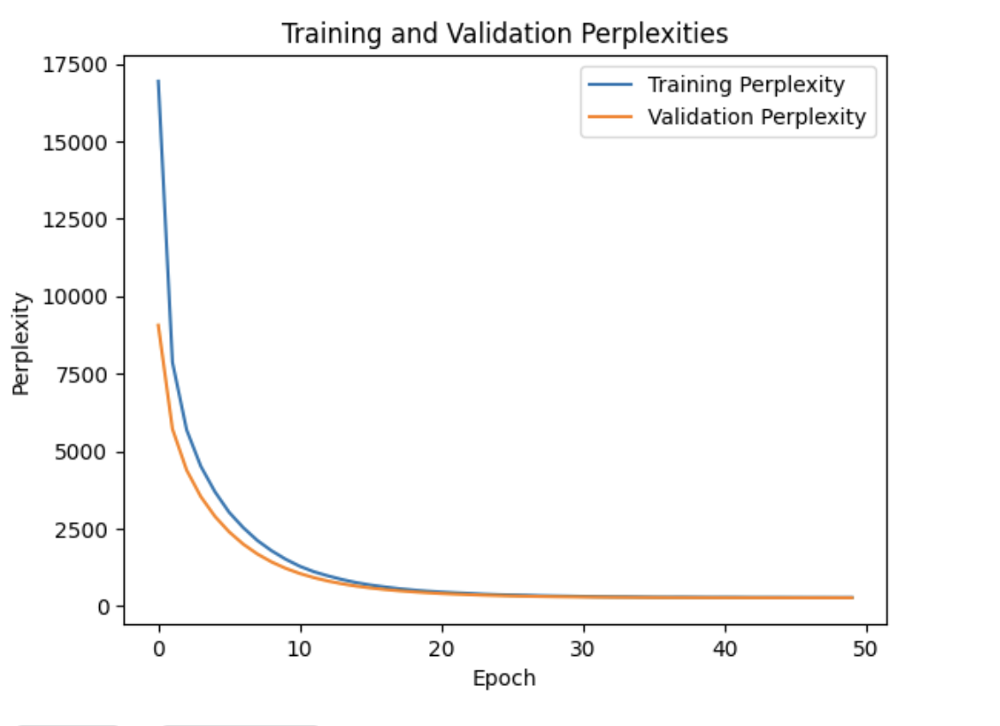

# Project Title

ANLP Assignment 1

___
## Part 1

- NLLM Architecture. Outputs of the (best)training loop are shown below:

```
Best hyperparameters: Hidden Size = 300, Dropout Rate = 0.1, Optimizer = SGD
Best Train Loss: 6.5990 | Best Val Loss: 6.5395
Best Train Perplexity: 734.3643 | Best Val Perplexity: 691.9239

```

- Perplexity and Loss Graphs:







___
## Part 2

- LSTM Architecture. Outputs of the training loop are shown below:

```Epoch 100/100: Train Loss = 6.9424, Val Loss = 6.9258, Train Perplexity = 1035.2972, Val Perplexity = 1018.2365```

- Perplexity and Loss Graphs:





___
## Part 3
- Transformer Decoder Architecture. Outputs of the training loop are shown below:

```Epoch [50/50], Train Loss: 5.6156, Val Loss: 5.5887, Train Perplexity: 274.6917, Val Perplexity: 267.3957```

- Perplexity and Loss Graphs:





